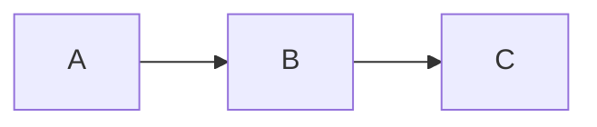
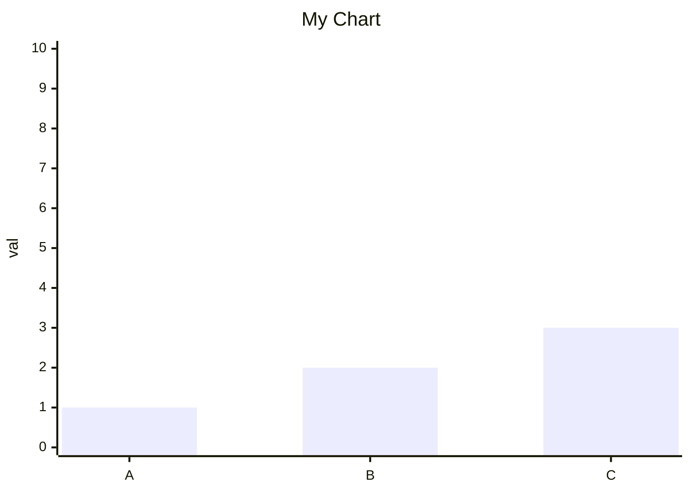
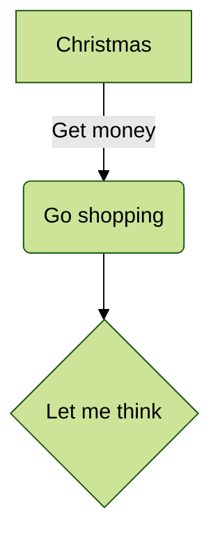
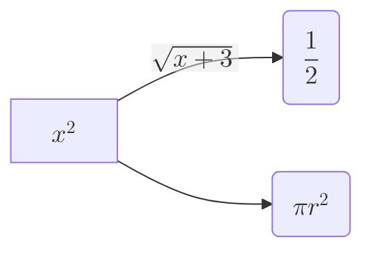
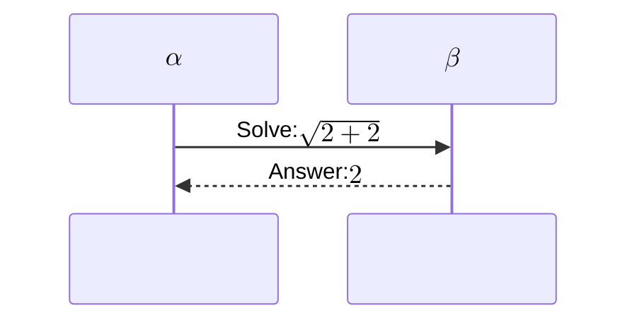

# Calamus

A GTK4 Markdown editor for GNOME — clean, fast, and compatible with Fedora, Ubuntu, Linux Mint, Debian, and openSUSE.

> **Installing?** See **[INSTALL.md](INSTALL.md)** for system install (`make && sudo make install`) and developer setup.

## Features

- Tabbed Markdown editing with live preview
- Full Markdown formatting toolbar (headings, bold, italic, lists, links, code, and more)
- Directory tree sidebar for navigating project files
- Export to HTML, PDF, and ODT
- Print and Print Preview via GTK
- Recent files (last 10 opened Markdown files)
- Find, Go to Line, Undo/Redo
- User preferences stored in `~/.config/Calamus/Calamus.conf`
- Dark/light/system theme support via Libadwaita

## Markdown Support

Calamus renders Markdown using [mistune 3](https://github.com/lepture/mistune)
(a CommonMark-based parser).  The table below shows which extensions from
popular Markdown flavours are supported and which gracefully fail over.

**Key:**
- ✅ **Supported** — renders as the spec intends
- ⚠️ **Graceful fail-over** — no crash; text content visible; surrounding
  document renders correctly (GLFM/GFM/ExtraMark-specific markup may appear
  as plain text)
- 🔧 **Available** — the underlying mistune 3 plugin exists; enable by adding
  the plugin name to `MistuneRenderer.__init__()` in `calamus/renderer.py`

---

### CommonMark (baseline)

All [CommonMark 0.31](https://spec.commonmark.org/0.31.2/) block and inline
constructs are supported: headings (ATX and setext), paragraphs, bold, italic,
strikethrough, inline code, fenced and indented code blocks, blockquotes,
ordered and unordered lists, thematic breaks, links, reference links, images,
and raw inline HTML.

---

### GitHub Flavored Markdown (GFM)

GFM defines exactly five extensions over CommonMark
([spec §4.10, §5.3, §6.5, §6.9, §6.11](https://github.github.com/gfm/)):

| Extension | Status | Notes |
|---|---|---|
| **Tables** (pipe syntax) | ✅ Supported | Via mistune `table` plugin |
| **Strikethrough** (`~~text~~`) | ✅ Supported | Via mistune `strikethrough` plugin |
| **Extended autolinks** (bare `https://`, `http://`) | ✅ Supported | Via mistune `url` plugin |
| **Extended autolinks** (`www.` URLs, bare emails) | ✅ Supported | Linkified as `https://www...` and `mailto:` |
| **Task list items** (`- [x]`, `- [ ]`) | 🔧 Available | Add `"task_lists"` plugin |
| **Disallowed raw HTML** (`<script>`, `<iframe>`, …) | ⚠️ Known divergence | Calamus renders local author content; HTML passes through unfiltered (no sanitisation needed for a desktop editor) |

---

### GitLab Flavored Markdown (GLFM)

GLFM extends CommonMark with GitLab-specific features
([docs](https://docs.gitlab.com/user/markdown/#differences-with-standard-markdown)).
Calamus is designed for editing GitLab repository files; the table below
documents every GLFM-only feature:

| Feature | Status | Notes |
|---|---|---|
| **Pipe tables** | ✅ Supported | Same as GFM |
| **Strikethrough** | ✅ Supported | Same as GFM |
| **URL autolinks** | ✅ Supported | Same as GFM |
| **GitLab references** (`#123`, `@user`, `!123`, `~label`, `%milestone`) | ⚠️ Graceful fail-over | Rendered as plain text; no GitLab context in editor |
| **Inline diff** (`{+ addition +}`, `{- deletion -}`) | ⚠️ Graceful fail-over | Text visible |
| **Description lists** | 🔧 Available | Add `"def_list"` plugin |
| **Task list inapplicable** (`- [~]`) | ⚠️ Graceful fail-over | `[~]` text visible (standard `[x]`/`[ ]` also 🔧 Available) |
| **Multiline blockquote** (`>>>`) | ⚠️ Graceful fail-over | Content visible as plain text |
| **JSON tables** (`` ```json:table ``` ``) | ⚠️ Graceful fail-over | Rendered as plain code block |
| **Math** (`$...$`, `$$...$$`, `` ```math `` ) | 🔧 Available | Add `"math"` plugin if available; currently graceful fail-over (LaTeX source visible) |
| **Table of contents** (`[[_TOC_]]`) | ✅ Supported | Generates a linked TOC from document headings |
| **Alerts** (`> [!note]`, `> [!warning]`, …) | ✅ Supported | Rendered as semantic/styled alert blockquotes |
| **Color chips** (`` `#FF0000` ``) | ⚠️ Graceful fail-over | Renders as `<code>` without color swatch |
| **Emoji shortcodes** (`:smile:`) | ✅ Supported | Known Tanuki shortcodes render as Unicode emoji; unknown shortcodes remain literal |
| **YAML / TOML / JSON front matter** | ⚠️ Graceful fail-over | Document body renders correctly |
| **Include directives** (`::include{file=…}`) | ⚠️ Graceful fail-over | No file embedding (intentional) |
| **Placeholders** (`%{project_name}`, …) | ⚠️ Graceful fail-over | Not resolved (no GitLab context) |
| **Mermaid diagrams** (`` ```mermaid `` ) | ✅ Supported | See [Mermaid Support](#mermaid-diagram-support) below |

---

### ExtraMark

ExtraMark branches directly from CommonMark (not GFM) to provide a unified,
portable extension standard
([repo](https://github.com/vimtaai/extramark)):

| Extension | Status | Notes |
|---|---|---|
| **Tables** | ✅ Supported | Same GFM pipe-table syntax |
| **Typographic replacements** (`---`, `...`, `(c)`, `(tm)`) | ⚠️ Graceful fail-over | ASCII forms preserved; no typographer pass |
| **Heading anchors** (id= + self-link for h1–h3) | ⚠️ Graceful fail-over | Headings render without `id=` attribute |
| **Definition lists** | 🔧 Available | Add `"def_list"` plugin |
| **Superscript** (`x^2^`) | 🔧 Available | Add `"superscript"` plugin |
| **Subscript** (`H~2~O`) | 🔧 Available | Add `"subscript"` plugin; single `~` does NOT trigger `~~` strikethrough |
| **Abbreviations** (`*[HTML]: expansion`) | 🔧 Available | Add `"abbr"` plugin |
| **Footnotes** (`[^1]`) | 🔧 Available | Add `"footnotes"` plugin |
| **Critic Markup** (`{++ ++}`, `{-- --}`, `{~~ ~> ~~}`, `{== ==}`, `{>> <<}`) | ⚠️ Graceful fail-over | No mistune plugin; text content visible |

> **Enabling 🔧 Available plugins:** All six plugins (`task_lists`, `def_list`,
> `footnotes`, `abbr`, `superscript`, `subscript`) ship with mistune 3 and
> require no extra dependencies.  Add the plugin name string to the `plugins`
> list in `MistuneRenderer.__init__()` in `calamus/renderer.py`.  The
> corresponding compatibility tests in `tests/test_gfm_compat.py` and
> `tests/test_extramark_compat.py` will automatically flip from Case 1
> (graceful fail-over) to Case 2 (supported) once enabled.

---

## Mermaid Diagram Support

Calamus supports [Mermaid](https://mermaid.js.org/) diagrams in fenced
`` ```mermaid `` code blocks via two rendering paths:

### Path 1 — Browser-side (mermaid.js, always available)

`mermaid.min.js` is bundled locally (fetched at build time by
`scripts/fetch-mermaid.sh`) and inlined into the WebKit preview.  No network
access is required at runtime.

````markdown

````

### Path 2 — Server-side pre-rendering (mmdc CLI, optional)

When the `mmdc` CLI is installed (part of `@mermaid-js/mermaid-cli`), Calamus
pre-renders all Mermaid diagrams to inline SVG **before** passing HTML to
WebKit.  This path is required for configuration features that are only applied
by the Node.js Mermaid engine (notably `labelRotation` in `xychart-beta`).

```bash
npm install -g @mermaid-js/mermaid-cli   # installs mmdc
```

### Configuration syntaxes

Both paths support two diagram configuration syntaxes:

#### YAML frontmatter (`---config:---`)

Placed between `---` delimiters at the top of the fenced block:

````markdown

````

#### Inline directive (`%%{init: ...}%%`)

Placed as the first line of the fenced block
([GLFM directive syntax](https://stackoverflow.com/a/66751560)):

````markdown

````

### Math in Mermaid (KaTeX — Mermaid v10.9.0+)

Mathematical expressions using [KaTeX](https://katex.org/) are supported
inside Mermaid node labels, edge labels, and sequence participants via the
`$$...$$` delimiter.  Supported diagram types: flowcharts and sequence diagrams.

````markdown

````

````markdown

````

The Python rendering pipeline passes `$$...$$` and all LaTeX commands
(`\sqrt`, `\frac`, `\alpha`, etc.) through `html.escape()` without
modification — `$` and `\` are not HTML-special characters.  The underlying
Mermaid engine (browser-side `mermaid.js` or `mmdc` CLI) renders the math via
KaTeX.

---

## Platform Compatibility

| Distribution | Minimum Version | GTK4 Version |
|---|---|---|
| Fedora | 44 | 4.22.x+ |
| Ubuntu | 25.04 | 4.22.x |
| Linux Mint | 22.x | 4.22.x |
| Debian | 13 (Trixie) | 4.22.x |
| openSUSE | Tumbleweed (rolling) | 4.22.x |

> **Note:** Older LTS releases (Ubuntu 24.04, Debian 12) ship GTK 4.14 and are **not** supported.

## Requirements

Calamus requires **GTK >= 4.22.4** (current stable as of April 2026).

### System packages

**Fedora 44+:**
```bash
sudo dnf install python3-gobject gtk4 libadwaita gtksourceview5 \
    typelib-Gtk-4_0 typelib-Adw-1 typelib-GtkSource-5
```

> **SELinux note (Fedora):** Fedora runs SELinux enforcing by default. On first
> run, test in permissive mode (`sudo setenforce 0`) to surface any denials, then
> re-enable (`sudo setenforce 1`). See [docs/selinux.md](docs/selinux.md) for
> the full guide.

**Ubuntu 25.04+ / Linux Mint 22.x+:**
```bash
sudo apt install python3-gi python3-gi-cairo gir1.2-gtk-4.0 \
    gir1.2-adw-1 gir1.2-gtksource-5 libgtk-4-1 libadwaita-1-0
```

**Debian 13+:**
```bash
sudo apt install python3-gi python3-gi-cairo gir1.2-gtk-4.0 \
    gir1.2-adw-1 gir1.2-gtksource-5 libgtk-4-1 libadwaita-1-0
```

**openSUSE Tumbleweed:**
```bash
sudo zypper install python3-gobject typelib-1_0-Gtk-4_0 \
    typelib-1_0-Adw-1 typelib-1_0-GtkSource-5
```

### uv (Python dependency manager)

```bash
curl -LsSf https://astral.sh/uv/install.sh | sh
```

## Installation

See **[INSTALL.md](INSTALL.md)** for full instructions. Quick reference:

**System install** (end users — installs to `/usr`, appears in app grid):
```bash
make && sudo make install
```

**Developer install** (run from source with `uv`):
```bash
uv sync --extra dev
uv run calamus
```

### Download Mermaid.js (required for diagram support)

```bash
bash scripts/fetch-mermaid.sh
```

This downloads `mermaid.min.js` 11.5.0 into `calamus/resources/js/` for offline diagram rendering.

## Running

```bash
uv run calamus
# or
python -m calamus
```

Common options:

```bash
calamus --preview README.md
echo "# Foo" | calamus --pipe-base-path /path/to/project
```

Use `--preview` for read-only viewing, and `--pipe-base-path` to resolve
relative links correctly when Markdown is piped in from stdin.

## Packaging & Distribution

### System install (meson + make)

The `Makefile` wraps [meson](https://mesonbuild.com/) to give users the
familiar `make` workflow.  It installs the complete application: Python
package, `calamus` launcher binary, desktop entry, and all icon sizes.

See **[INSTALL.md](INSTALL.md)** for the full walkthrough including per-distro
dependency commands, per-user install, and troubleshooting.

```bash
make && sudo make install      # installs to /usr
make uninstall                 # removes everything meson installed
```

### RPM (Fedora)

The spec file at `resources/rpm/calamus.spec` builds a proper Fedora RPM using
the `%pyproject_*` macros, which read `pyproject.toml` directly.

**Prerequisites:**
```bash
sudo dnf install rpm-build python3-devel pyproject-rpm-macros desktop-file-utils rpmdevtools
```

**Set up the rpmbuild tree (first time only):**
```bash
rpmdev-setuptree
```

**Copy the spec and create a source tarball from HEAD:**
```bash
cp resources/rpm/calamus.spec ~/rpmbuild/SPECS/
git archive --format=tar.gz --prefix=calamus-0.1.0/ HEAD \
    > ~/rpmbuild/SOURCES/calamus-0.1.0.tar.gz
```

**Build the RPM:**
```bash
rpmbuild -ba ~/rpmbuild/SPECS/calamus.spec
```

**Install the resulting RPM:**
```bash
sudo dnf install ~/rpmbuild/RPMS/noarch/calamus-0.1.0-1.*.rpm
```

> Update the `Version:` and `%changelog` entry in the spec whenever
> `pyproject.toml` version bumps.

---

### Flatpak

The manifest at `resources/flatpak/io.github.mray271.calamus.yaml` targets the
**GNOME 48 runtime**, which already bundles GTK4 and pygobject.  Only the
pure-Python dependencies (`mistune`, `odfpy`, `weasyprint`) need to be
pip-installed into the app bundle.

> **App ID note:** The current ID `io.github.mray271.calamus` is a placeholder.
> See the TODO comment in the manifest before submitting to Flathub.

**Prerequisites:**
```bash
sudo dnf install flatpak flatpak-builder
flatpak remote-add --if-not-exists flathub https://dl.flathub.org/repo/flathub.flatpakrepo
flatpak install flathub org.gnome.Platform//48 org.gnome.Sdk//48
```

**Build and run locally (without installing):**
```bash
flatpak-builder --force-clean build-dir \
    resources/flatpak/io.github.mray271.calamus.yaml
flatpak-builder --run build-dir \
    resources/flatpak/io.github.mray271.calamus.yaml calamus
```

**Install for the current user:**
```bash
flatpak-builder --force-clean --install --user build-dir \
    resources/flatpak/io.github.mray271.calamus.yaml
flatpak run io.github.mray271.calamus
```

**Uninstall:**
```bash
flatpak uninstall io.github.mray271.calamus
```

**Preparing for Flathub submission:**
Replace the `pip install` network step in the manifest with offline source
entries generated by
[flatpak-pip-generator](https://github.com/flatpak/flatpak-pip-generator):
```bash
pip install flatpak-pip-generator
flatpak-pip-generator mistune odfpy weasyprint \
    -o resources/flatpak/python3-deps
```
Then reference `python3-deps.json` as a source in the manifest in place of the
`pip install` shell command.

---

## Development

### Setup

```bash
uv sync --extra dev
```

### Running tests

```bash
uv run pytest
```

### Checking formatting

```bash
uv run black --check .
```

### Auto-formatting

```bash
uv run black .
```

### Using Docker

Docker provides a fully self-contained development environment with all system GTK4
dependencies pre-installed — no local GTK libraries required.

#### Running the app (happy path)

```bash
docker compose up
```

That's it. The compose file is pre-configured to forward your X11 display into the
container using your session's `.Xauthority` credentials, so the app window appears
on your desktop without any extra setup.

> **How X11 forwarding works (no `xhost` needed):**
> X11 uses MIT-MAGIC-COOKIE authentication. Your session's auth file (pointed to by
> `$XAUTHORITY` — e.g. `~/.Xauthority` or a session-specific path under
> `/run/user/1000/`) is mounted read-only into the container. The container is fixed to
> `XAUTHORITY=/root/.Xauthority` and `XDG_RUNTIME_DIR=/tmp` so GTK4 finds both the
> auth cookie and the display socket at the expected paths. `network_mode: host` lets
> the hostname in the cookie match. No `xhost +local:` is needed and the X server
> remains locked down.

> **Fedora / SELinux note:** `docker-compose.yml` sets `security_opt: label=disable`
> so the container can access the X11 socket under SELinux enforcing mode without
> needing `--privileged`.

#### Other common commands

**Build the image** (first time, or after `Dockerfile` changes):

```bash
docker compose build
```

**Run the full test suite:**

```bash
docker compose run --rm test
```

**Run a single test file:**

```bash
docker compose run --rm test uv run pytest tests/test_mermaid_support.py -v
```

**Check code formatting:**

```bash
docker compose run --rm format-check
```

**Auto-format code:**

```bash
docker compose run --rm format-check uv run black .
```

**Open an interactive shell in the container:**

```bash
docker compose run --rm app bash
```

**Rebuild after dependency changes:**

```bash
docker compose build --no-cache
```

## Project Structure

```
calamus/           Main Python package
tests/             Test suite (pytest)
.github/workflows/ CI/CD pipelines
docs/              Documentation and screenshots
```

## Contributing

See [CONTRIBUTING.md](CONTRIBUTING.md) for guidelines.

## License

GNU General Public License v3.0 or later (GPLv3+). See [LICENSE](LICENSE).

---

Copyright 2026 Daniel P. Dougherty and the Calamus contributors.
