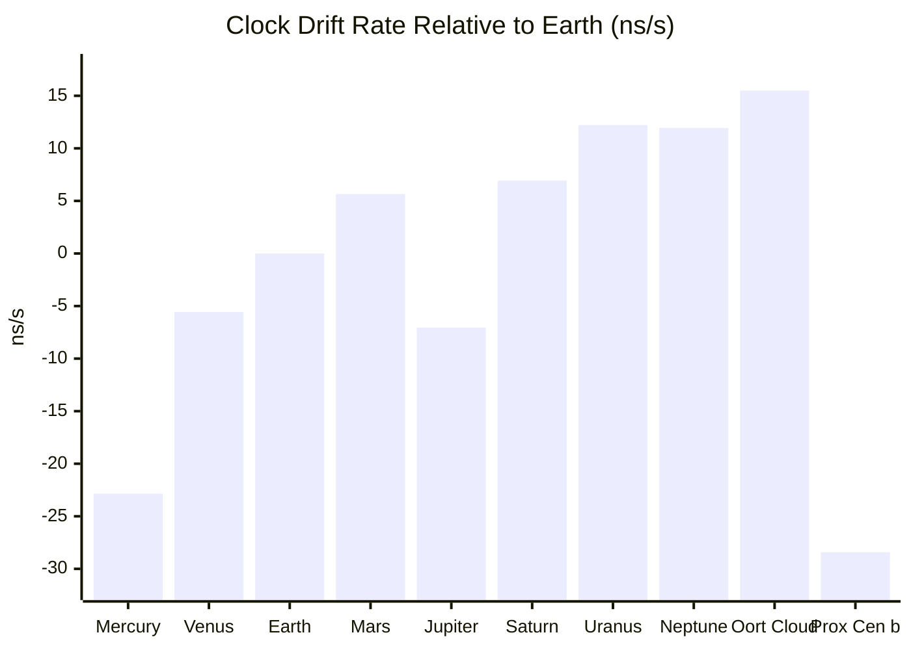

# Relativistic Clock Drift: From Mercury to Proxima Centauri b

**Generated:** 2026-07-04

---

## Overview

Clocks on different planets run at slightly different rates than on Earth due to two relativistic effects:

- **Gravitational time dilation (GR):** Deeper in a gravitational well → slower clock. Contributions come from the Sun's gravity at the orbital distance *and* the planet's own surface gravity.
- **Velocity time dilation (SR):** Faster movement → slower clock. Orbital speed around the Sun is the main contributor.

The combined fractional rate difference (planet vs. Earth) is:

```
Δ(dτ/dt) = [(-GM_sun/r_orbit - v_orbit²/2 - GM_planet/R_planet)
            - (-GM_sun/r_earth - v_earth²/2 - GM_earth/R_earth)] / c²
```

Multiplied by 10⁹ gives **nanoseconds per second (ns/s)**.

For **Proxima Centauri b**, the reference frame is extended to account for Proxima Centauri's own velocity relative to the Sun (≈32.5 km/s), which adds a significant SR time dilation term:

---

## Time Offset Table

| Planet | Rate (ns/s) | After 120,000 years |
|------------------------|:-----------:|--------------------:|
| Mercury | −22.8466 | −1.00 days |
| Venus | −5.5646 | −5.85 hours |
| **Earth** | 0.0000 | 0 *(reference)* |
| Mars | +5.6579 | +5.95 hours |
| Jupiter | −7.0632 | −7.43 hours |
| Saturn | +6.9413 | +7.30 hours |
| Uranus | +12.2075 | +12.84 hours |
| Neptune | +11.9378 | +12.56 hours |
| Oort Cloud (≈50,000 AU) | +15.5011 | +0.68 days |
| Proxima Centauri b | −28.4312 | −1.25 days |

**Positive** = clock runs *faster* than Earth's.  
**Negative** = clock runs *slower* than Earth's.



---

## Component Breakdown (ns/s)

| Planet | Solar ΔΦ | Orbital KE | Surface ΔΦ | **Total** |
|------------------------|----------:|----------:|----------:|----------:|
| Mercury | −25.4991 | −12.7484 | −0.1005 | **−22.8466** |
| Venus | −13.6459 | −6.8228 | −0.5973 | **−5.5646** |
| Earth *(ref)* | −9.8705 | −4.9348 | −0.6961 | **0.0000** |
| Mars | −6.4781 | −3.2250 | −0.1403 | **+5.6579** |
| Jupiter | −1.8971 | −0.9503 | −19.7171 | **−7.0632** |
| Saturn | −1.0350 | −0.5224 | −7.0027 | **+6.9413** |
| Uranus | −0.5143 | −0.2572 | −2.5223 | **+12.2075** |
| Neptune | −0.3285 | −0.1640 | −3.0710 | **+11.9378** |
| Oort Cloud (≈50k AU) | −0.0002 | −0.0001 | ≈0 | **+15.5011** |
| Proxima Centauri b | −24.8492 ¹ | −12.4246 + −5.8781 ² | −0.7807 | **−28.4312** |

---

## Notable Results

- **Mercury** has the slowest clocks in the solar system (among the 8 planets + Oort Cloud sampled): it is close to the Sun *and* moves fastest in its orbit. Its clock loses exactly **1 day** relative to Earth over ≈120,000 years.

- **Jupiter** runs *slower* than Earth despite being far from the Sun, because its enormous surface gravity (−19.7 ns/s) overwhelms the benefit of its greater orbital distance.

- **Uranus and Neptune** run the fastest among the 8 planets (≈+12 ns/s), gaining roughly half a day on Earth every 120,000 years.

- **Oort Cloud planetesimal** (≈50,000 AU) runs even faster (+15.5 ns/s) because it is so far from the Sun's gravitational well and moves at only ≈133 m/s. Its tiny surface gravity (≈10 km radius, 500 kg/m³) is negligible.

- **Proxima Centauri b** has the slowest clock in this table (−28.4 ns/s), losing **1.25 days** relative to Earth over 120,000 years. Three factors compound: Proxima Centauri's deep gravitational well at the planet's tight 0.0485 AU orbit, a fast orbital speed (≈47 km/s), and the entire Proxima system moving at ≈32.5 km/s relative to the Sun.

---

## Proxima Centauri b — Component Detail

| Effect | Value (ns/s) |
|---|---:|
| Proxima Centauri gravity at orbit | −24.8492 |
| Orbital velocity around Proxima (≈47 km/s) | −12.4246 |
| Proxima system velocity relative to Sun (≈32.5 km/s) | −5.8781 |
| Surface gravity of planet (≈1.04 R~⊕~, ≈1.17 M~⊕~) | −0.7807 |
| Sun's gravity at 4.24 ly (negligible) | −0.0000 |
| **Total** | **−28.4312** |

¹ Proxima Centauri gravity replaces Solar gravity as the dominant potential well.  
² Orbital KE + stellar velocity SR term combined.

---

## How Long for Mercury to Drift 1 Full Day?

| Quantity | Value |
|---|---|
| Mercury drift rate | 22.8466 ns/s |
| 1 day in nanoseconds | 8.64 × 10¹³ ns |
| Time to accumulate 1 day of drift | **≈119,836 years** (≈120,000 years) |

---

## Parameters Used

| Constant | Value |
|---|---|
| Speed of light *c* | 2.99792458 × 10⁸ m/s |
| GM~☉~ | 1.32712440018 × 10²⁰ m³/s² |
| 120,000 years in seconds | 3.7869 × 10¹² s |

Planet semi-major axes, orbital velocities, GM, and radii from standard IAU/NASA values.  
Oort Cloud object assumed at **50,000 AU**, radius **10 km**, density **500 kg/m³** (comet-like).  
Proxima Centauri b: semi-major axis **0.0485 AU**, M~★~ = **0.1221 M~☉~**, planet mass **≈1.17 M~⊕~**, radius **≈1.04 R~⊕~** (rocky scaling), Proxima velocity relative to Sun **≈32.5 km/s** (radial −22.2 km/s + transverse ≈23.7 km/s from proper motion 3.85″/yr at 4.243 ly).
