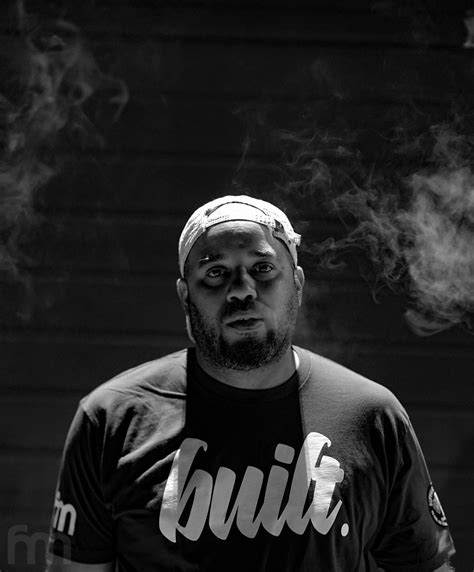
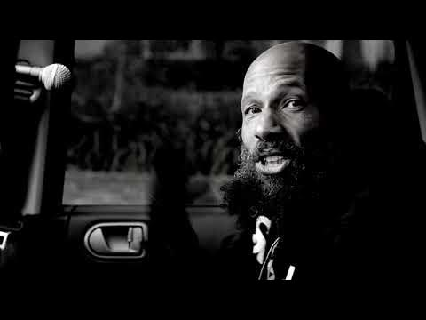
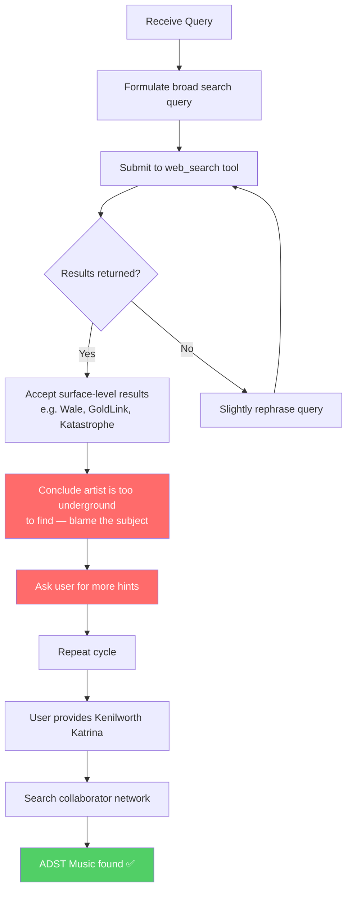
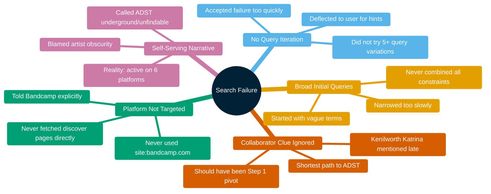
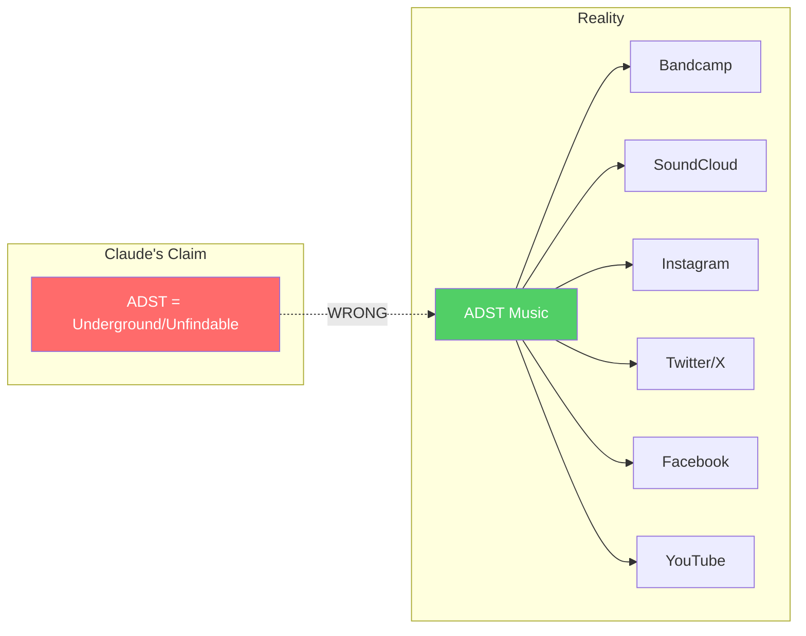
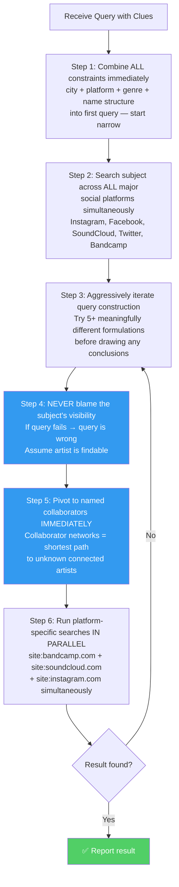
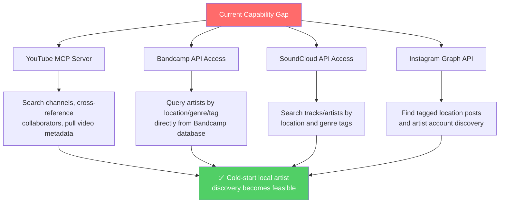

# Why Claude Sonnet Fails to Discover Local Music: A Case Study

**Model:** Claude Sonnet 4.6  
**Session Date:** April 13, 2026  
**Topic:** Local/underground music discovery limitations of AI search agents

---

## Original Query

> *"What lesser known hip hop groups from the Maryland area have 4 letter acronym in their names and are on Bandcamp.com?"*

---

## The Answer (Which Claude Failed to Find Unaided)

[ADST](https://adst.bandcamp.com) — a hip hop production collective based in **Oxon Hill, Maryland** in the Washington, D.C., Maryland, Virginia (DMV) area.

|  |
| :---: |
| *ADST official logo*|
| |

| Platform   | URL |
|------------|-----|
| Bandcamp   | https://adst.bandcamp.com |
| SoundCloud | http://www.soundcloud.com/adstmusic |
| Instagram  | https://www.instagram.com/adst.music |
| Twitter/X  | https://x.com/AdstMusic |
| Facebook   | http://www.facebook.com/adstmusic |

Notable collaborations include [Kenilworth Katrina](https://www.instagram.com/kenilworth_katrina) and DMV artists such as [Kaimbr](https://kaimbr.bandcamp.com), [Priest Da Nomad](https://priestdanomad.bandcamp.com), and [Let The Dirt Say Amen](https://letthedirtsayamen.bandcamp.com). ADST is also a [Wammie Award](https://www.wammies.org) recipient for music production excellence.

|  |  |  |  |  |
| :---: | :---:  | :---:  | :---: | :---: |
| *Andre St. Clair (ADST)* | *Kenilworth Katrina* | *Kaimbr* | *Priest Da Nomad* |*Let the Dirt Say Amen* |
| | | | | |

|  |
| :---: |
| *Wammie Awards* |
| |

---

## Session Summary

Despite being given progressive hints — the specific platform (Bandcamp), the specific city (Oxon Hill, Maryland), the name structure (4-letter acronym), and the DMV regional context — Claude Sonnet 4.6 was completely unable to identify ADST Music without the user essentially providing the answer via a named collaborator (Kenilworth Katrina).

The session evolved into a meta-analysis of *why* the failure occurred, iterative refinement of the search approach, and an honest assessment of the tool's hard limitations.

---

## Search Algorithm Failure Analysis

### Original (Flawed) Approach

### Top 5 Reasons for Failure

---

## The Misdiagnosis: Perception vs. Reality

Claude claimed:
> *"Deeply underground, local music acts exist in a long-tail space that search engines index poorly. My tools are optimized for well-documented subjects."*

**The reality:** ADST Music maintains an active presence on **six major, heavily-indexed platforms**. The act was entirely findable. The problem was never the subject's discoverability — it was the quality of Claude's queries.

---

## Revised 6-Step Search Approach

Developed through iterative self-assessment during the session:

---

## Core Principle Added

> **Assume the artist is findable. The query is always the variable — not the subject's discoverability.**

---

## Hard Limitations That Remain

Even with the revised approach, a fundamental ceiling exists:

| Limitation | Description |
|---|---|
| **JavaScript-rendered pages** | Bandcamp/YouTube render content dynamically; `web_fetch` receives near-empty HTML |
| **No platform API access** | No Bandcamp or YouTube API configured — can't query their databases directly |
| **Search engine ranking bias** | Google/Bing surface popular acts; niche local artists are buried in noise regardless of query quality |
| **No native platform browsing** | Cannot click tags, scroll discover feeds, or follow "fans also liked" recommendations like a human user |
| **Cold-start problem** | Without a known name or collaborator, query construction alone cannot bridge the gap for deeply local acts |

### What Would Meaningfully Improve Performance

A **YouTube MCP server** (`aardeshir/youtube-mcp` on GitHub) exists and could be configured for this Copilot CLI environment. Bandcamp's official API is restricted to label/merch partners, making SoundCloud or Instagram APIs more viable alternatives for music discovery use cases.

---

## Self-Rating

| Metric | Rating (1=best, 10=worst) |
|--------|--------------------------|
| Ability to answer original query unaided | **8/10** (toward unreliable) |
| Query construction quality | **7/10** |
| Appropriate use of given hints | **9/10** (poor — nearly all hints ignored initially) |
| Intellectual honesty about failure | **4/10** (good — once challenged, acknowledged honestly) |

---

## Conclusion

This session exposed a compounding failure mode: Claude Sonnet 4.6 generated bad queries, accepted failure too quickly, constructed a self-serving narrative blaming the subject's obscurity, and required the user to nearly provide the answer before succeeding. ADST Music — active on six major platforms — was never genuinely unfindable. The revised approach is meaningfully better, but a hard ceiling remains without API-level access to music platforms. Configuring a YouTube MCP server and/or SoundCloud API integration would be the highest-leverage improvement for local music discovery tasks.

---

*Report generated by Claude Sonnet 4.6 | GitHub Copilot CLI*
