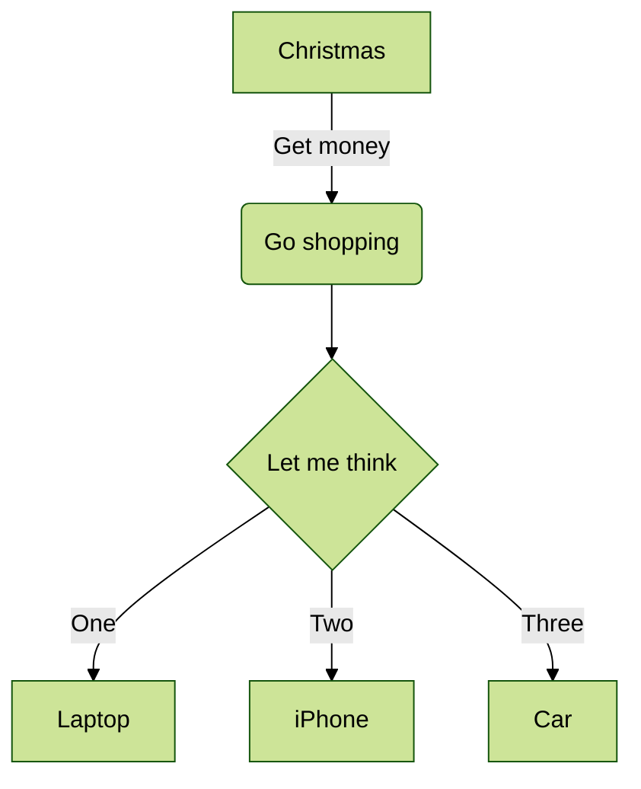

# Mermaid Directive Syntax — GLFM Example

Based on the answer at https://stackoverflow.com/a/66751560 which demonstrates
using the Mermaid `%%{init: ...}%%` directive syntax to configure diagram
properties inline within a GitLab Flavored Markdown (GLFM) code block.

The `%%{init: {...}}%%` directive is placed at the very start of the mermaid
block and is processed by the Mermaid renderer (browser-side or mmdc CLI) to
apply configuration such as theme, themeVariables, and diagram-specific options.

---

