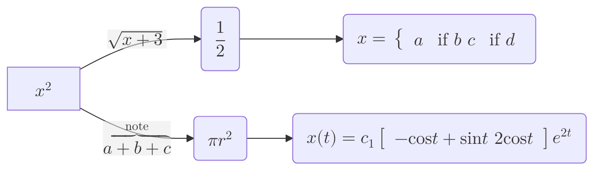
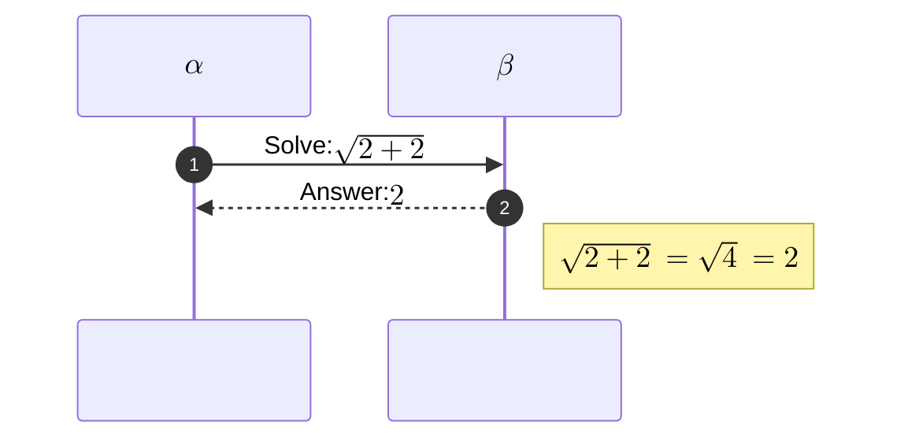

# Mermaid Math Examples (KaTeX v10.9.0+)

Mermaid supports mathematical expressions through the [KaTeX](https://katex.org/)
typesetter (Mermaid v10.9.0+).  The `$$...$$` delimiter is used inside diagram
node labels, edge labels, and sequence participants.

Reference: https://mermaid.js.org/config/math.html

---

## Flowchart with Math Nodes and Edge Labels

## Sequence Diagram with Math Participants and Messages

